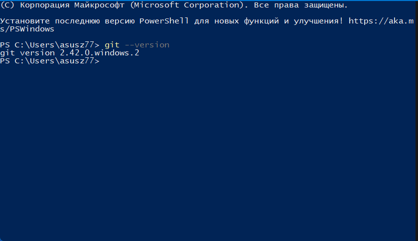
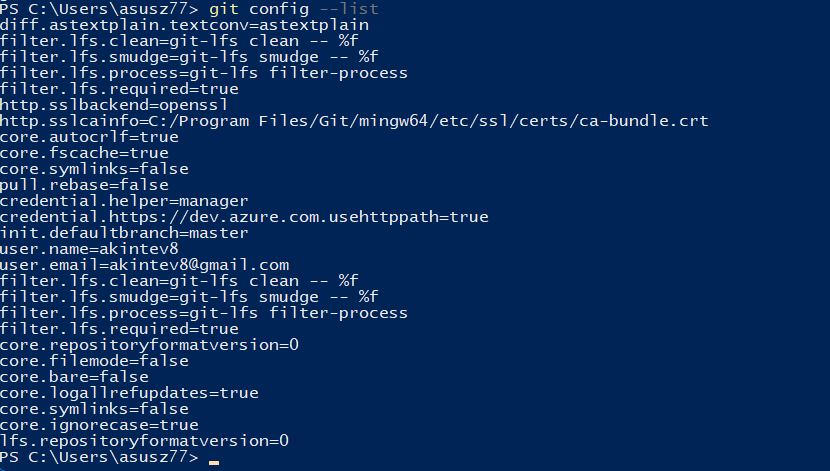
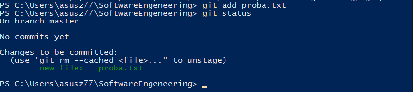
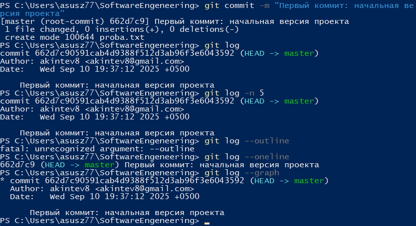
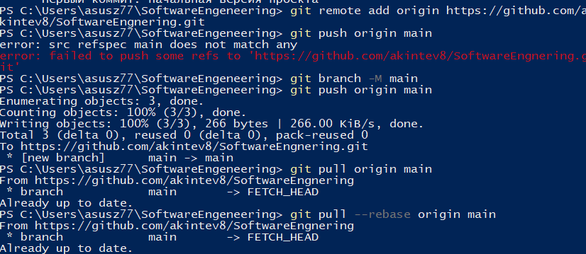
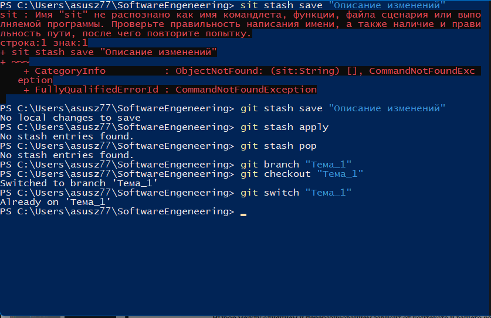
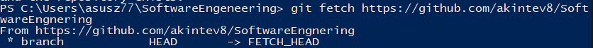
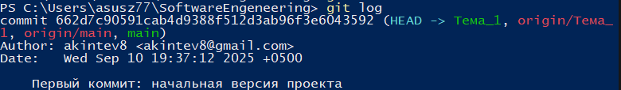
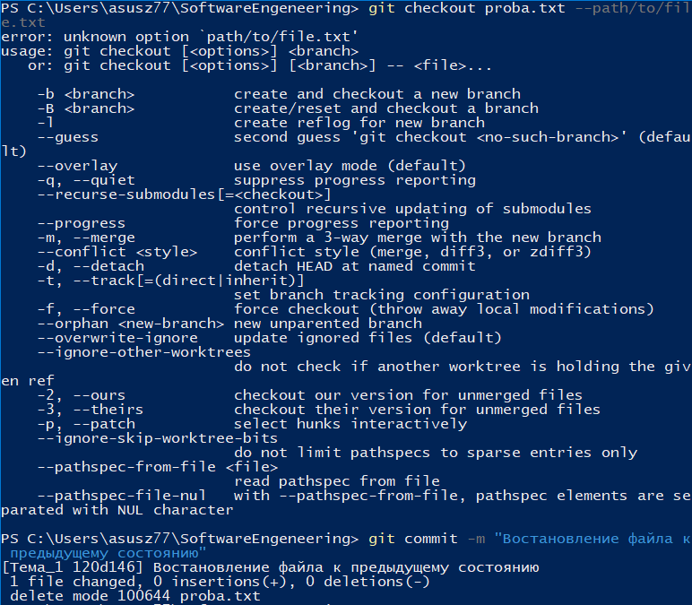
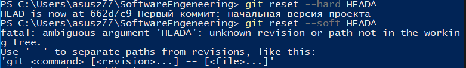

# Тема: Работа с Git
Выполнил: Акинтьев Александр Максимович 

Группа: ИВТ-23-1
| № Задания           | Выполнено                              |
|---------------------|--------------------------------------|
| 2.1      | +             |
| 2.2   | +        |
| 2.3           | +     | 
| 2.4   | +|
| 2.5   | +|
| 2.6   | +|
| 2.7   | +|
| 2.8   | +|
| 2.9   | +|
| 2.10   | +|
| 2.11   | +|
| 2.12   | +|
| 2.13   | +|
| 2.14   | +|
| 2.15   | +|
# Выполнение заданий
# Задание 2.1: Установка

Вывод: Установил Git на пк и проверил версию
# Задание 2.2: Настройка

Вывод: Настроил параметры email и имя

# Задание 2.3: Создание нового репозитория

Вывод: Создал новый репозиторий "SoftwareEngnering"

# Задание 2.4: Подготовка файлов

Вывод: Подгтовил файлы для дальнейшего комита

# Задание 2.5: Фиксация изменений

Вывод: Был сделан первый коммит

# Задание 2.6: Подключение к удаленному репозиторию

Вывод: Подключился к удалённому репозиторию и создал ветку main

# Задание 2.7: Ветвление

Вывод: Создал ветку Тема_1 и переключился в неё

# Задание 2.8: Особенности применения «Фетч»

Вывод: Сделал фетч и загрузил всё из удалённого репозитория

# Задание 2.9: Удаление файлов, веток, локальных и удалённых репозиториев

Вывод: Удалил файл

# Задание 2.10: Отслеживание изменений в коммитах

Вывод: Посмотрел все изменения в ветке 

# Задание 2.11: Возвращение файла к предыдущему (определенному) состоянию

Вывод: Востановил файл к предыдущему состоянию

# Задание 2.12: Возвращение к предыдущему коммиту

Вывод: Вернулся к предыдущему коммиту при помощи hard и soft

# Задание 2.13: Возвращение к предыдущему коммиту

Вывод: Вернулся к предыдущему коммиту при помощи hard и soft

# Задание 2.14: Разрешение конфликтов при слиянии

Вывод: Научился разрешать конфликты во время слияния

# Задание 2.15: Настройка .gitignore

Вывод: Настроил файл .gitignore

# Итоговый вывод
Я научился работать с Git и GitHub. Теперь могу хранить проекты на удалённом сервере, а не только на компьютере, и работать над ними совместно с другими людьми. Знание Git помогает отслеживать изменения в коде и управлять разными версиями проекта.
